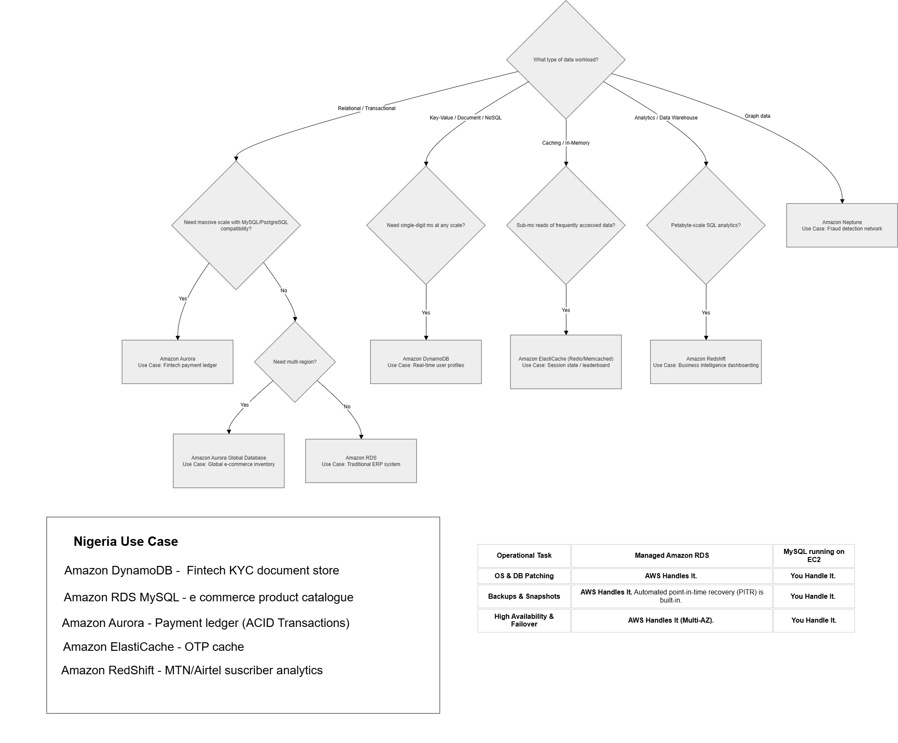

## AWS Database Selection

Architecting cloud solutions requires choosing the right database engine based on data workload characteristics, performance bounds, and operational engineering constraints. Below is the decision framework and a comparative analysis used to select data tiers across various AWS services.

### Database Selection Decision Tree
This tree provides a structured path for identifying the ideal AWS database service based on the specific architectural requirements of the data workload:

### When to Use vs. Avoid Amazon DynamoDB
Amazon DynamoDB is ideal for high-throughput, unstructured or semi-structured data workloads requiring predictable, single-digit millisecond latency at any scale, such as user session management or real-time shopping carts. DynamoDB should be avoided for complex transactional workloads that depend heavily on relational data joins, complex multi-table queries, or frequently shifting access patterns that make primary key optimization impractical.

